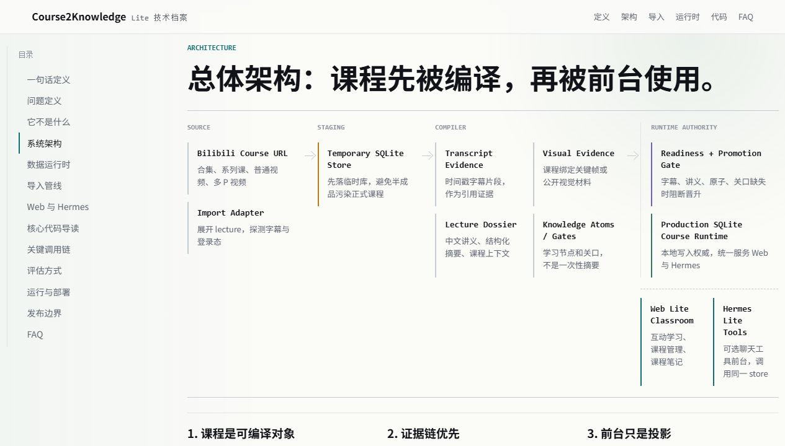
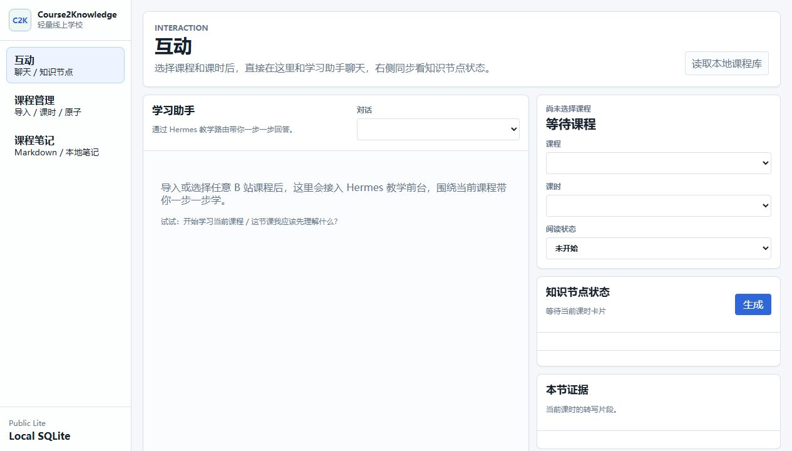

# Course2Knowledge Lite

把在线视频课程编译成本地 SQLite 课程知识运行时。

Course2Knowledge Lite 不是 LMS、普通 RAG demo、笔记软件、视频下载器，也不是通用 Agent 框架。它把一门 B 站视频课当作证据源，经过字幕、视觉证据、中文讲义、知识原子和学习关口的编译，落到本地 SQLite 课程运行时，再由 Web Lite 课堂和可选 Hermes Lite 工具前台读取。

[技术档案](https://blackzhanzhan.github.io/course2knowledge-lite/) · [技术白皮书](docs/TECHNICAL_WHITEPAPER.md) · [部署说明](docs/DEPLOYMENT.md) · [测试说明](docs/TESTING.md)



## 它解决什么问题

很多课程工具只停在三件事：下载视频、转写字幕、生成摘要。Course2Knowledge Lite 的目标不同：它把课程编译成可以反复学习、检查、问答和扩展的本地运行时。

- 课程不只是视频列表，而是 course、lecture、字幕片段、讲义、知识原子、关口、视觉证据和学习记录的组合。
- 回答问题不直接依赖模型即兴发挥，而是优先回到本地课程证据。
- 前台不是数据权威。Web Lite 和 Hermes Lite 都只是同一份 SQLite store 的投影。
- 导入不是“一边跑一边污染正式库”，而是先落临时库，再通过 readiness / promotion gate 合并。

## 它不是什么

- 不是 LMS：不处理机构、班级、作业、成绩和教务流程。
- 不是普通 RAG demo：检索与问答存在，但核心产物是可复用的课程知识运行时。
- 不是笔记软件：笔记是课程证据的下游表达，不是唯一状态。
- 不是视频下载器：重点不在保存视频，而在把课程证据编译成可学习对象。
- 不是 Agent 框架：Hermes 是可选工具前台，业务权威仍然在本地 SQLite runtime。

## 前台形态

Web Lite 是主课堂前台，收敛成三个模块：互动、课程管理、课程笔记。截图来自本地真实 Web Lite 前台的安全空状态，不包含 cookie、私密聊天或本地课程数据。



## 核心架构

```text
Bilibili Course URL
  -> Import Adapter
  -> Temporary SQLite Store
  -> Transcript / Visual Evidence
  -> Lecture Dossier
  -> Knowledge Atoms / Gates
  -> Readiness + Promotion Gate
  -> Production SQLite Course Runtime
  -> Web Lite Classroom
  -> optional Hermes Lite Tools
```

这条链路里最重要的设计是“先编译，再交互”：

- `Source`：支持 B 站合集、系列课、普通视频和多 P 视频。
- `Staging`：导入先写临时 SQLite store，避免半成品进入正式课程库。
- `Compiler`：生成字幕证据、视觉证据、中文讲义、知识原子和关口。
- `Runtime Authority`：正式 SQLite store 是本地写入权威。
- `Frontdesk Projection`：Web Lite 与 Hermes Lite 只读取或调用同一个 runtime。

## 能做什么

- 从 B 站课程 URL 展开有序 lecture。
- 获取字幕证据，并保留时间戳、来源 URL 和片段引用。
- 生成中文讲义、知识原子、学习关口和可选视觉证据。
- 用 readiness gate 检查导入是否完整，阻断缺字幕、缺讲义、缺原子、缺关口的半成品。
- 在 Web Lite 中进行课程导入、课程选择、聊天带学、知识节点查看、笔记阅读、书签和阅读进度记录。
- 通过 Hermes Lite 工具前台访问同一份本地课程 store。
- 将聊天线程、消息和事件持久化到 SQLite。

## 快速开始

要求：

- Python 3.11 或更新版本。
- 真实 B 站导入需要网络访问。

安装并启动：

```bash
pip install -e .
course2knowledge-lite web
```

默认地址：

```text
http://127.0.0.1:3014/
```

指定临时 store 运行：

```bash
course2knowledge-lite web --store-root tmp/release-web-store
```

导入测试 URL 示例：

```text
https://space.bilibili.com/1112988584/lists/7726472?type=season
```

## B 站登录态

公共版支持三种登录态路径：

- 二维码登录：在 Web Lite 导入面板扫码获取字幕所需登录态。
- 单次 cookie：只用于当前导入，不持久化。
- remember-cookie：用户显式选择后保存到本机 `.codex/auth/`，该目录被 git 忽略。

仓库、文档、截图和测试证据都不应包含真实 cookie、二维码密钥、API key 或生产聊天内容。

## Hermes 的位置

Hermes Lite 是可选工具前台，不是核心业务运行时。它注册一组课程原生工具，调用的仍然是公共 package API 和同一个 SQLite store。

典型工具包括：

- `collection_import_start`
- `import_status_get`
- `course_transcript_coverage_get`
- `knowledge_cards_generate`
- `lecture_reader_get`
- `learning_guide_get`
- `course_search`
- `course_question_answer`
- `course_visual_evidence_send`
- notes / bookmarks / reading-progress 相关工具

这使聊天前台可以通过工具访问课程对象，而不是猜测文件、拼 prompt 或维护另一套数据。

## 核心代码地图

| 路径 | 作用 |
| --- | --- |
| `src/course2knowledge_lite/cli.py` | CLI 入口，启动 Web、同步 Hermes profile、运行 smoke。 |
| `apps/web/server.py` | Web Lite 本地服务器、导入 API、聊天 SSE、B 站登录态、安全错误展示。 |
| `apps/web/static/app.js` | 三模块前台交互：互动、课程管理、课程笔记。 |
| `packages/bilibili-import/src/course2knowledge_lite_bilibili/collection.py` | B 站合集、系列课、普通视频、多 P 视频展开。 |
| `packages/bilibili-import/src/course2knowledge_lite_bilibili/subtitles.py` | B 站字幕探测、获取与 cookie 脱敏。 |
| `packages/bilibili-import/src/course2knowledge_lite_bilibili/handoff.py` | 导入管线：写入临时 store、生成讲义/原子/关口/视觉证据、产出 readiness。 |
| `packages/bilibili-import/src/course2knowledge_lite_bilibili/parallelism.py` | 导入并发策略，控制讲义编译与请求扇出。 |
| `packages/course-store/src/course2knowledge_lite_store/sqlite_store.py` | SQLite 数据模型与 store API。 |
| `packages/course-store/src/course2knowledge_lite_store/lecture_dossier.py` | 中文讲义、知识原子和关口生成入口。 |
| `packages/course-store/src/course2knowledge_lite_store/dossier_core/` | 可迁移的课程 dossier 编译核心。 |
| `packages/course-store/src/course2knowledge_lite_store/chat.py` | Lite Chat Core 与聊天事件持久化。 |
| `hermes/plugins/course2knowledge-lite/tools.py` | Hermes Lite 工具注册与工具处理器。 |

## 数据边界

发布包应该包含：

- Python package 与 CLI。
- Web Lite 静态资源。
- Hermes Lite profile template 与 plugin。
- docs 中公开使用的截图和视觉证据素材。
- 测试 fixture 与安全示例。

发布包不应该包含：

- `data/course-store/` 下的真实 SQLite 运行数据。
- `tmp/` 下的临时导入 store。
- `.codex/auth/` 或任何 B 站登录材料。
- API key、模型供应商 secret、生产聊天导出、母项目私有状态。

## 测试

常用发布前检查：

```bash
python -m unittest tests.test_deployment
python -m unittest discover -s tests
python -m pip wheel . -w tmp/release-precheck/wheelhouse --no-deps --no-cache-dir
node --check apps/web/static/app.js
node --check docs/site.js
git diff --check
```

当前公共发布线曾在干净发布目录中通过：

- `python -m unittest discover -s tests`：118 tests OK。
- `python -m unittest tests.test_deployment`：3 tests OK。
- wheel build：passed。
- Web JS 与 docs JS syntax check：passed。
- 发布树排除了本地 SQLite、`tmp/`、`.codex/auth/` 和运行时生成关键帧。

## 文档入口

- [GitHub Pages 技术档案](https://blackzhanzhan.github.io/course2knowledge-lite/)
- [技术白皮书](docs/TECHNICAL_WHITEPAPER.md)
- [架构说明](docs/ARCHITECTURE.md)
- [数据模型](docs/DATA_MODEL.md)
- [Web Lite](docs/WEB_LITE.md)
- [Feishu/Hermes Lite](docs/FEISHU_LITE.md)
- [Bilibili Import](docs/BILIBILI_IMPORT.md)
- [部署说明](docs/DEPLOYMENT.md)
- [测试说明](docs/TESTING.md)
